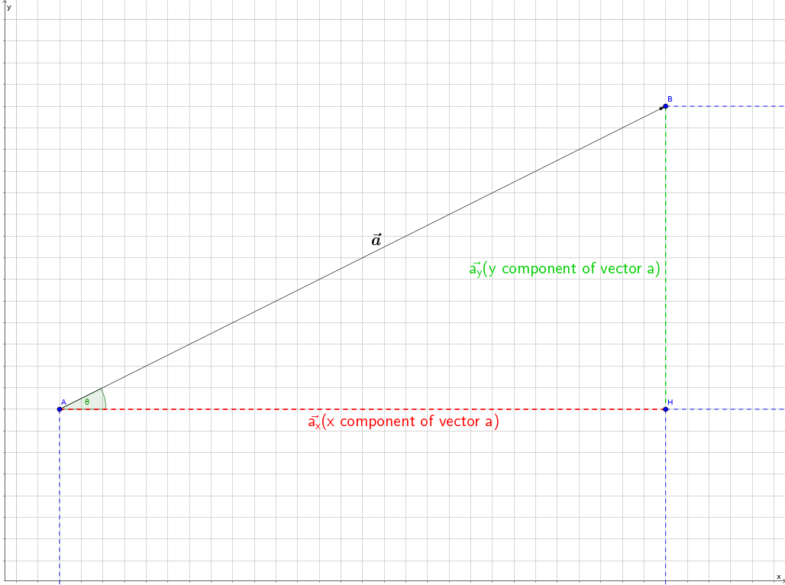

# Vector Algebra
**Note:**
This page does not attempt to be a substitute for a full lesson in Vector Algebra. This is simply a quick reference to the subject matter.
_Please refer to your math lessons on the subject for a full understanding._

## Components of Vectors
> The **component** of a vector is its ** projection** on the axis of interest

### Example

Let us examine a vector \\(\vec{a}\\) in an arbitrary cartesian coordinate system:

In this example, \\(\vec{a\_x}\\) is the _x component of \\(\vec{a}\\)_ and \\(\vec{a\_y}\\) is the _y component of \\(\vec{a}\\)_.

It can be seen that the length _(scalar)_ of **AH** is \\(a\cos\theta\\) and the length of **BH** is \\(a\sin\theta\\)

From **Pythogoras Theorem**, \\(AB^2 = AH^2 + BH^2\\)

Thus, the magnitude of a vector is the **root** of the **sum of squares** of its components

### Reference Materials
  * [Wikipedia: Vector Projection](https://en.wikipedia.org/wiki/Vector_projection)
  * Video Lesson
    
---

## Sum of Vectors
> The **resultant vector** of the sum of 2 or more vectors is the **superposition** of the **sum of the components of the vectors**
